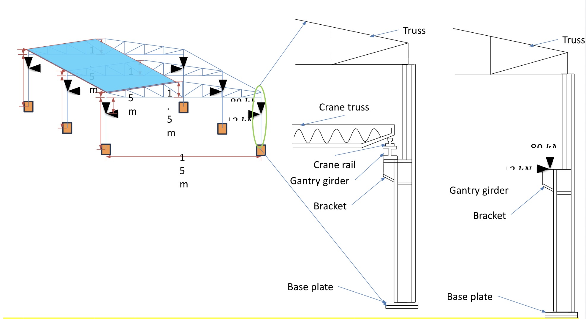

Methodology: 

1. Roof purlins (Use C-sections):-
For wind load calculations,IS 875 (Part 3): 2015 was used.

2. Purlins:-
IS 800 2007, IS 808 were used. The wind load is divided equally amongst all the purlins. C section was used for purlin.
	
3. Tension and compression members of the trusses (take an L-section):-
Wind load along with weight of claddings and purlins acts on the truss. This is distributed among the 3 trusses. The truss takes these forces in addition to its self weight. We took the maximum tension and compression amongst all the truss members and designed the L section for those forces. This can be further improved by designing top chord, bottom chord and mid members separately.

4. Gusseted joints in the trusses:-
The joints are welded together with the gusset plates. The maximum forces to be resisted were taken and weld was designed for those forces.This can be further improved by designing top chord, bottom chord and mid members’ weld separately.

5. Columns:-
Upper Column: The force on the truss was divided amongst the two columns. Column took those forces along with its self weight.
Lower Column: The lower column took an additional weight from the gantry girder. This force is assumed to be concentric and no moment is considered in the designing process.
Splice Connection: The flanges are transferring the complete force to the lower column from the upper column in additional to the extra load.

6. Column base plates:-
IS 800 2007 methodology was used. 

7. Reinforced concrete footing:-
IS 456 2000 methodology was used. The soil was assumed to have the bearing of 300 kN/mm2 at a depth of 1.5 m.

The Drawing od the bulding is:

