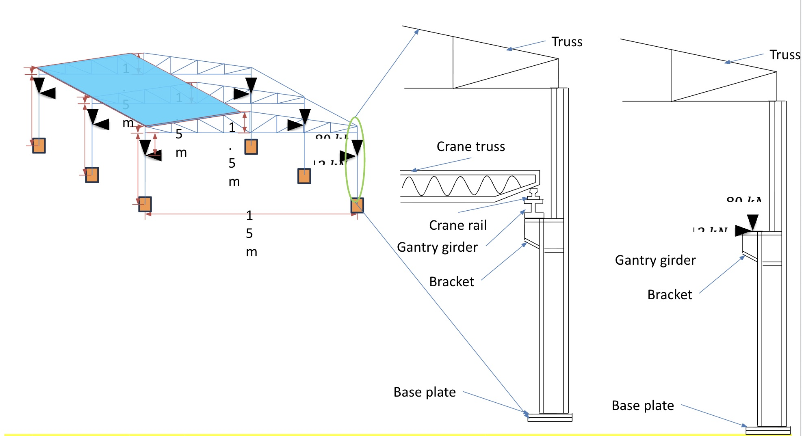
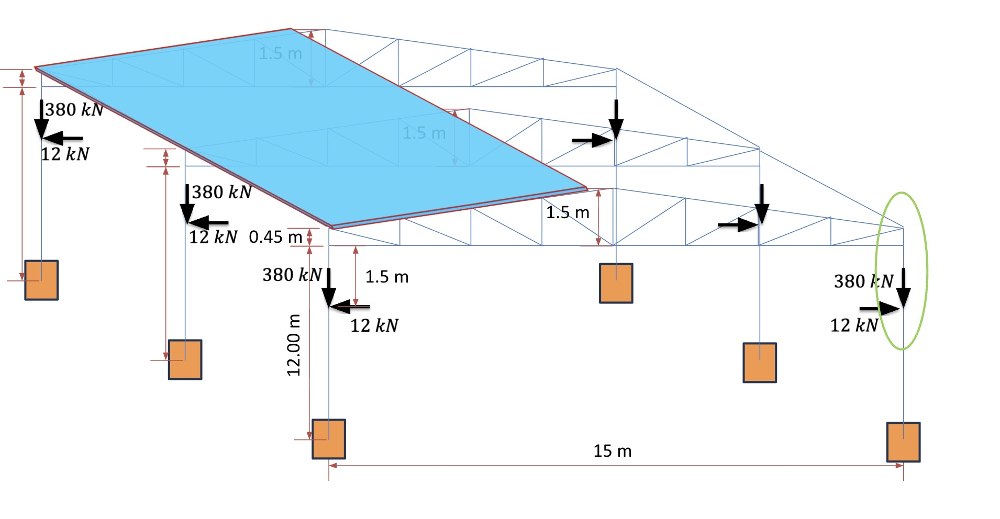

# Structural Design of Industrial Steel Building

This project presents the **structural design of a steel building with concrete footing** following Indian Standards and the Limit State Design method. The design addresses roof purlins, truss members, columns, gusseted joints, base plates, and reinforced concrete footings with detailed calculations based on relevant codes.

---

## Methodology

### 1. Roof Purlins (C-sections)  
Wind load calculations are based on **IS 875 (Part 3): 2015**. C-section steel purlins were selected for the roof framework.

### 2. Purlins  
Design follows **IS 800:2007** and **IS 808** standards. The wind load is equally distributed among all purlins, which are also made from C-sections.

### 3. Tension and Compression Members of Trusses (L-sections)  
The trusses carry wind loads, weights of claddings, and purlins, distributed among three trusses. Maximum tension and compression forces were used to design the L-section members. Future improvements could separately design top chords, bottom chords, and mid-members.

### 4. Gusseted Joints in Trusses  
Joints are welded with gusset plates to resist maximum forces. Weld design could be further refined by analyzing top chord, bottom chord, and mid-member welds individually.

### 5. Columns  
- **Upper Columns:** Forces from trusses are divided among two columns along with their self-weight.  
- **Lower Columns:** These bear additional weight from the gantry girder, assumed concentric without moment consideration.  
- **Splice Connections:** Flanges transfer the full force from the upper to the lower columns, plus any extra load.

### 6. Column Base Plates  
Base plate design follows the **IS 800:2007** methodology, ensuring stable load transfer to footing.

### 7. Reinforced Concrete Footing  
Designed as per **IS 456:2000** assuming soil bearing capacity of 300 kN/m² at 1.5 m depth.

---

## Project Files and Visuals

- **CAD Model:**  
  Access the 3D model of the project on Onshape:  
  [CAD File](https://cad.onshape.com/documents/089190b78e7418bf8d3659e1/w/3c35eebfe22cfa329f4c0ae9/e/51e61a87b672adeaec0c15ca?renderMode=0&uiState=68028e55d7bede229ca4160e)

- **Drawings:**  
    
  

---

## Notes  
- This design strictly follows Indian Standards and uses the Limit State Design for safety and efficiency.  
- Further improvements could focus on detailed member-wise weld design and moment considerations in columns. 
